# Deep Research Agent with Ollama & Tavily

A powerful, local Deep Research Agent that leverages **DeepSeek-R1** (via Ollama) for reasoning and **Tavily API** for real-time web search. This agent plans its research, executes search queries, and synthesizes comprehensive answers with citations.

## Features

- **Local LLM Intelligence**: Uses `deepseek-r1:8b` running locally on Ollama for privacy and cost-efficiency.
- **Real-time Web Search**: Integrates with Tavily API to fetch the latest information.
- **Smart Planning**: The agent "thinks" about the user's query to generate targeted search plans.
- **HTML Reporting**: Automatically generates detailed HTML reports with search results and final answers.
- **CLI & Interactive Modes**: Flexible usage options.

## Prerequisites

1. **Python 3.8+**
2. **Ollama**: Installed and running.
    - Pull the model: `ollama pull deepseek-r1:8b`
    - Start the server: `ollama serve`
3. **Tavily API Key**: Get one at [tavily.com](https://tavily.com).

## Installation

1. Clone the repository:

    ```bash
    git clone <repository-url>
    cd <repository-directory>
    ```

2. Install dependencies:

    ```bash
    pip install requests python-dotenv markdown
    ```

3. Set up environment variables:
    - Create a `.env` file (or copy `.env.example`):

      ```bash
      cp .env.example .env
      ```

    - Edit `.env` and add your API key:

      ```env
      TAVILY_API_KEY=tvly-xxxxxxxxxxxxxxxxxxxxxxxxxxxx
      ```

## Usage

### Interactive Mode

Run the agent and enter queries interactively:

```bash
python main.py
```

### Command Line Mode

Run a single query directly from the terminal:

```bash
python main.py "What is the latest news on Solid State Batteries?" --advanced
python main.py "Analyze the impact of Nvidia's acquisition of Groq on the AI ​​chip industry." --advanced
```

- `--advanced`: (Optional) Use advanced search depth for more comprehensive results.

## Model Selection

You can choose between using a local Ollama model or cloud-based models (if configured in your Ollama setup).

### Available Models

- **Local**: `deepseek-r1:8b` (Default) - Runs locally on your machine.
- **DeepSeek Cloud**: `deepseek-v3.1:671b-cloud` - High-performance cloud model.
- **GPT Cloud**: `gpt-oss:120b-cloud` - Alternative cloud model.

### Selecting a Model via CLI

Use the `--model` argument to specify the model at runtime:

```bash
# Use DeepSeek Cloud
python main.py "Your query here" --model deepseek-cloud

# Use GPT Cloud
python main.py "Your query here" --model gpt-cloud

# Use Local Model explicitly
python main.py "Your query here" --model local
```

### Setting Default Model

You can change the default model in `config.py`:

```python
class LLMConfig:
    # ...
    # Default Configuration
    MODEL_NAME = MODEL_DEEPSEEK_CLOUD  # Change this to your preferred default
    # ...
```

## Configuration

You can adjust settings in `config.py`:

- **TavilyConfig**: `SEARCH_DEPTH`, `MAX_RESULTS`, etc.
- **LLMConfig**: `MODEL_NAME`, `TEMPERATURE`, `CONTEXT_WINDOW`.
- **ReportConfig**: `RESULTS_DIR`.

## Output

- **Console**: Displays the agent's thinking process, search queries, and final answer.
- **HTML Reports**: Saved in the `results/` directory (e.g., `results/research_report_20251204_083047.html`).

## System Architecture

```mermaid
graph TD
    %% Define Styles
    classDef user fill:#f9f9f9,stroke:#333,stroke-width:2px,color:black;
    classDef logic fill:#e1f5fe,stroke:#0277bd,stroke-width:2px,color:black;
    classDef llm fill:#fff9c4,stroke:#fbc02d,stroke-width:2px,stroke-dasharray: 5 5,color:black;
    classDef ext fill:#e0f2f1,stroke:#00695c,stroke-width:2px,color:black;
    classDef output fill:#dcedc8,stroke:#558b2f,stroke-width:2px,color:black;

    %% Nodes
    User(["👤 User Query"]):::user
    
    subgraph Agent [Deep Research Agent]
        direction TB
        
        %% Step 1: Planning
        Planner("Plan Research"):::logic
        Think1{"LLM Reasoning<br/>(DeepSeek-R1)"}:::llm
        Queries["Generated Search Queries"]:::logic
        
        %% Step 2: Execution
        Executor("Execute Search"):::logic
        Tavily("Tavily API"):::ext
        Results["Raw Search Results"]:::logic
        
        %% Step 3: Synthesis
        Synthesizer("Synthesize Answer"):::logic
        Think2{"LLM Synthesis<br/>(DeepSeek-R1)"}:::llm
    end
    
    Output1["Console Output<br/>(Thinking Process & Answer)"]:::output
    Output2["HTML Report<br/>(results/*.html)"]:::output

    %% Flow Connections
    User --> Planner
    Planner --> Think1
    Think1 -- "<think> & JSON" --> Queries
    
    Queries --> Executor
    Executor -- "Search Query" --> Tavily
    Tavily -- "Web Content" --> Executor
    Executor --> Results
    
    Results --> Synthesizer
    Synthesizer --> Think2
    Think2 -- "Final Answer with Citations" --> Output1
    Think2 --> Output2
```



## License

MIT License
