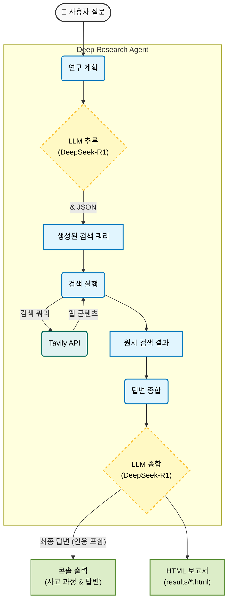

# Deep Research Agent with Ollama & Tavily

**DeepSeek-R1** (Ollama 경유)의 추론 능력과 **Tavily API**의 실시간 웹 검색 기능을 활용하는 강력한 로컬 딥 리서치 에이전트입니다. 이 에이전트는 연구를 계획하고, 검색 쿼리를 실행하며, 인용이 포함된 포괄적인 답변을 종합합니다.

## 주요 기능

- **로컬 LLM 지능**: 개인 정보 보호와 비용 효율성을 위해 Ollama에서 로컬로 실행되는 `deepseek-r1:8b`를 사용합니다.
- **실시간 웹 검색**: Tavily API와 통합하여 최신 정보를 가져옵니다.
- **스마트 플래닝**: 에이전트가 사용자 질문에 대해 "생각(think)"하여 목표 지향적인 검색 계획을 생성합니다.
- **HTML 보고서**: 검색 결과와 최종 답변이 포함된 상세한 HTML 보고서를 자동으로 생성합니다.
- **CLI 및 대화형 모드**: 유연한 사용 옵션을 제공합니다.

## 전제 조건

1. **Python 3.8 이상**
2. **Ollama**: 설치 및 실행 필요.
    - 모델 다운로드: `ollama pull deepseek-r1:8b`
    - 서버 시작: `ollama serve`
3. **Tavily API Key**: [tavily.com](https://tavily.com)에서 발급받으세요.

## 설치

1. 리포지토리 클론:

    ```bash
    git clone <repository-url>
    cd <repository-directory>
    ```

2. 의존성 설치:

    ```bash
    pip install requests python-dotenv markdown
    ```

3. 환경 변수 설정:
    - `.env` 파일 생성 (또는 `.env.example` 복사):

      ```bash
      cp .env.example .env
      ```

    - `.env` 파일을 편집하고 API 키를 추가하세요:

      ```env
      TAVILY_API_KEY=tvly-xxxxxxxxxxxxxxxxxxxxxxxxxxxx
      ```

## 사용법

### 대화형 모드

에이전트를 실행하고 대화형으로 질문을 입력하세요:

```bash
python main.py
```

### 커맨드 라인 모드

터미널에서 직접 단일 질문을 실행하세요:

```bash
python main.py "전고체 배터리에 대한 최근 뉴스는 무엇입니까?" --advanced
```

- `--advanced`: (선택 사항) 더 포괄적인 결과를 위해 고급 검색 깊이를 사용합니다.

## 모델 선택

로컬 Ollama 모델 또는 클라우드 기반 모델(Ollama 설정에 구성된 경우) 중에서 선택할 수 있습니다.

### 사용 가능한 모델

- **Local**: `deepseek-r1:8b` (기본값) - 로컬 머신에서 실행됩니다.
- **DeepSeek Cloud**: `deepseek-v3.1:671b-cloud` - 고성능 클라우드 모델.
- **GPT Cloud**: `gpt-oss:120b-cloud` - 대체 클라우드 모델.

### CLI를 통한 모델 선택

`--model` 인수를 사용하여 런타임에 모델을 지정하세요:

```bash
# DeepSeek Cloud 사용
python main.py "여기에 질문 입력" --model deepseek-cloud

# GPT Cloud 사용
python main.py "여기에 질문 입력" --model gpt-cloud

# 로컬 모델 명시적 사용
python main.py "여기에 질문 입력" --model local
```

### 기본 모델 설정

`config.py`에서 기본 모델을 변경할 수 있습니다:

```python
class LLMConfig:
    # ...
    # 기본 구성
    MODEL_NAME = MODEL_DEEPSEEK_CLOUD  # 원하는 기본값으로 변경하세요
    # ...
```

## 구성

`config.py`에서 설정을 조정할 수 있습니다:

- **TavilyConfig**: `SEARCH_DEPTH` (검색 깊이), `MAX_RESULTS` (최대 결과 수) 등.
- **LLMConfig**: `MODEL_NAME` (모델명), `TEMPERATURE` (온도), `CONTEXT_WINDOW` (컨텍스트 윈도우).
- **ReportConfig**: `RESULTS_DIR` (결과 디렉토리).

## 출력

- **콘솔**: 에이전트의 사고 과정, 검색 쿼리, 최종 답변을 표시합니다.
- **HTML 보고서**: `results/` 디렉토리에 저장됩니다 (예: `results/research_report_20251204_083047.html`).

## 시스템 아키텍처



## 라이선스

MIT License
